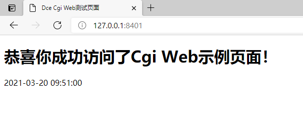

# Cgi式Web服务

## 介绍

传统Cgi式PHP Web服务示例，配合Nginx/Apache/IIS等Web服务器提供Web服务

### 演示截图



### 目录结构
```shell
[ROOT]                                        应用根目录（可在入口文件中定义APP_ROOT常量自定义）
├─project                                     项目根目录（可在入口文件中定义APP_PROJECT_ROOT常量自定义）
│  ├─home                                     项目目录
│  │  ├─config                                项目配置目录
│  │  │  ├─nodes.php                          项目节点配置
│  │  ├─controller                            项目控制器目录
│  │  │  ├─CommonController.php               接口控制器
│  │  ├─template                              渲染模板目录
│  │  │  ├─common
│  │  │  │  ├─index.php                       待渲染模板视图文件
├─www                                         静态资源目录
│  ├─index.php                                Cgi入口文件
├─README.md                                   说明文件
```

## 使用

### 配置Web服务器
将Web服务器（Nginx/Apache/IIS）的文档目录指向`www`，所有配置完毕后启动服务器（具体操作请百度谷歌）

### 访问Web页面
根据你配置主机及端口到浏览器访问该服务

HTTP接口
- `GET /` 根据模板渲染出的页面
- `GET /?/detail` JSON型接口页面
- `POST /?/add` JSON型接口页面, 仅支持POST请求 (参见 nodes.php 的节点配置文件)