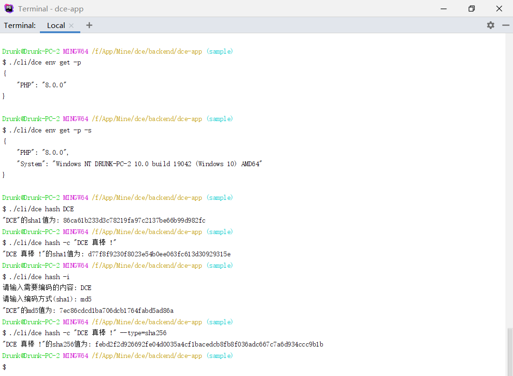

# 命令行编程演示

## 介绍

命令行式工具编程，以通用的RCR模式编写命令行工具演示（使用了注解式节点配置而不是通过nodes.php配置）

### 演示截图



### 目录结构
```shell
[ROOT]                                        应用根目录（可在入口文件中定义APP_ROOT常量自定义）
├─project                                     项目根目录（可在入口文件中定义APP_PROJECT_ROOT常量自定义）
│  ├─utility                                  项目目录
│  │  ├─config                                项目配置目录
│  │  │  ├─nodes.php                          项目节点配置
│  │  ├─controller                            项目控制器目录
│  │  │  ├─EnvController.php                  环境变量工具控制器
│  │  │  ├─HashController.php                 Hash工具控制器
├─dce                                         Shell/PHP脚本版Dce工具
├─dce.bat                                     Windows命令行版Dce工具
├─README.md                                   说明文件
```

## 使用

### 在Shell中使用
```shell
./dce hash DCE
```

### 作为PHP脚本使用
```shell
php ./dce hash DCE
```

### 在Windows命令行使用
```shell
.\dce.bat hash DCE
```

### 传入参数
```shell
./dce hash -c DCE
# 或
./dce hash -c=DCE
```

### 交互模式

```shell
./dce hash -i
```