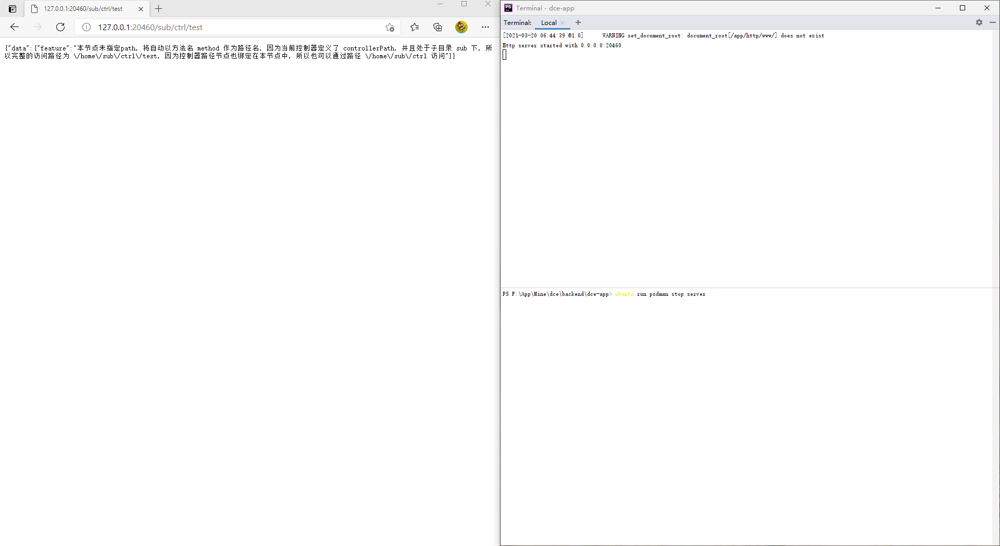

# 常驻内存网页

## 介绍

使用内置HTTP服务器提供Web服务（需在Linux下有Swoole的PHP环境执行）。

### 演示截图



### 目录结构
```shell
[ROOT]                                        应用根目录（可在入口文件中定义APP_ROOT常量自定义）
├─project                                     项目根目录（可在入口文件中定义APP_PROJECT_ROOT常量自定义）
│  ├─home                                     项目目录
│  │  ├─controller                            项目控制器目录
│  │  │  ├─sub                                项目控制器子目录
│  │  │  │  ├─PathController.php              子控制器
│  │  │  ├─HtmlController.php                 Html渲染控制器
│  │  │  ├─JsonpController.php                Jsonp渲染控制器
│  │  │  ├─PathController.php                 
│  │  │  ├─XmlController.php                  Xml渲染控制器
│  │  ├─template                              渲染模板目录
│  │  │  ├─about.php                          about页面模板
│  │  │  ├─index.php                          index页面模板
├─dce                                         Shell/PHP脚本版Dce工具
├─README.md                                   说明文件
```

## 使用

### 启动HTTP服务器

```shell
ubuntu run podman run --rm --name server -it -v /mnt/f/App/Mine/dce/backend/dce-app/:/app/ -p 20460:20460 idrunk/swoole /app/http/dce http start
```

### 打开浏览器访问

```
# 访问默认首页
http://127.0.0.1:20460

# 访问关于页
http://127.0.0.1:20460/about

# 访问Jsonp接口
http://127.0.0.1:20460/detail2.js?callback=callback123

# 控制器级节点示例
http://127.0.0.1:20460/ctrl/test

# 访问XML接口
http://127.0.0.1:20460/detail.xml

# 访问子目录控制器级节点
http://127.0.0.1:20460/sub/ctrl/test

# 访问子目录控制器级节点 (单接口配置的多节点)
http://127.0.0.1:20460/sub/ctrl
```

### 停止HTTP服务

```shell
# 使用Dce的HTTP命令行工具接口
ubuntu run podman exec server /app/http/dce http stop
# 或停止容器
ubuntu run podman stop server
```