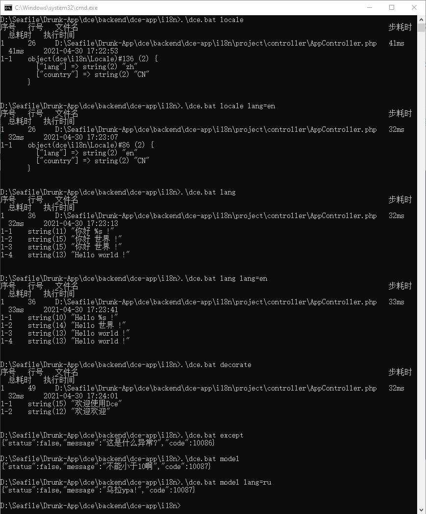

# 国际化与类装饰器

## 介绍

本项目主要演示了语种文本映射类的各种姿势的使用以及装饰器的应用

### 演示截图



### 目录结构
```shell
[ROOT]                                        应用根目录（可在入口文件中定义APP_ROOT常量自定义）
├─common                                      公共目录（可在入口文件中定义APP_COMMON常量自定义）
│  ├─config                                   公共配置目录
│  │  ├─config.php                            公共配置文件 (主要配置了语种映射工厂，方便动态扩展语种)
│  ├─model                                    公共模型目录
│  │  ├─TestModel.php                         测试模型类，定义了多语种版校验器异常消息
│  ├─service                                  公共服务目录
│  │  ├─LangException.php                     测试异常类，定义了异常消息及代码
│  │  ├─LangService.php                       语种映射工厂类
├─project                                     项目根目录（可在入口文件中定义APP_PROJECT_ROOT常量自定义）
│  ├─controller                               项目控制器目录
│  │  ├─AppController.php
├─dce                                         Shell/PHP脚本版Dce工具
├─dce.bat                                     Windows命令行版Dce工具
├─README.md                                   说明文件
```

## 使用

*为了方便，作者在Windows下进行的编程及测试。测试使用前请确保你是PHP8的环境，且将php可执行文件加入到了环境变量中*

### 取当前本地化环境

```cmd
.\dce.bat locale

# 指定语种为en
.\dce.bat locale lang=en
```

可以从上述结果截图看到，未指定语种时本地化对象语种属性为默认值`zh`，指定后为指定的语种。

### 直接使用多语种文本类

```cmd
.\dce.bat lang

# 指定语种为en
.\dce.bat lang lang=en
```

可以从上述结果截图看到，未指定语种时打印的文本为默认的中文文本，指定后为英文文本，但最后在代码中指定英文的部分始终都是英文。

### 使用自动实例化的多语种文本静态属性

```cmd
.\dce.bat decorate
```

可以从上述结果截图看到，两种形式的类静态属性都被正常自动实例化并打印，你也可以通过自行在命令行追加语种参数测试

### 使用多语种异常消息

```cmd
.\dce.bat except
```

可以从上述结果截图看到，因为异常类封装了Language支持，解析注解时自动将异常码常量作为id传给Language实例化，所以可以仅需传入异常码即可找到对应的多语种异常消息。你也可以通过自行在命令行追加语种参数测试

### 使用模型校验器的多语种异常提示

```cmd
.\dce.bat model
```

可以从上述结果截图看到，定义的多语种版校验异常提示被成功输出，你也可以通过自行在命令行追加语种参数测试

### 动态语种工厂的应用

```cmd
.\dce.bat model lang=ru
```

可以从上述结果截图看到，这里指定了语种为`ru`，但语种文本映射表中没有该语种，这时会尝试调用配置的工厂方法，该方法将返回与文本id对应的语种文本映射表，该表有`ru`语种文本，所以成功打印出`ru`语种文本。

***建议你查看本测试项目源码以加深了解。***