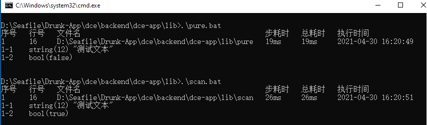

# 库模式Dce编程

## 介绍

库模式编程是指仅将Dce作为依赖库，而不引导路由执行控制器方法的编程。此种模式有两种使用方式，一种纯库模式，即仅自动加载Dce库；另一种为加载项目库的模式，即除了加载Dce库外还会扫描加载项目类库及公共目录类库。他们都仅注册自动加载，而不引导路由执行控制器方法。

### 演示截图



### 目录结构
```shell
[ROOT]                                        应用根目录（可在入口文件中定义APP_ROOT常量自定义）
├─app                                         项目根目录（可在入口文件中定义APP_PROJECT_ROOT常量自定义）
│  ├─controller                               项目控制器目录
│  │  ├─DefaultController.php                 接口控制器
├─pure                                        纯库模式编程可执行脚本Linux版
├─pure.bat                                    纯库模式编程可执行脚本Windows版
├─README.md                                   说明文件
├─scan                                        加载项目库模式编程可执行脚本Linux版
├─scan.bat                                    加载项目库模式编程可执行脚本Windows版
```

## 使用

*为了方便，作者在Windows下进行的编程及测试。测试使用前请确保你是PHP8的环境，且将php可执行文件加入到了环境变量中*

1. 打开命令行并进入当前文档所在目录
```cmd
cd {当前目录}
```

2. 执行`pure.bat`与`scan.bat`
```cmd
.\pure.bat
.\scan.bat
```

你将分别看到如下输出:
```
1-1    string(12) "测试文本"
1-2    bool(false)
```

```
1-1    string(12) "测试文本"
1-2    bool(true)
```

3. 从结果可以看到：都正常加载了Dce类库，`pure`脚本由于未扫描注册项目及公共类库，所以未找到`app\controller\DefaultController`，而`scan`脚本扫描注册了，所以成功找到了`DefaultController`。