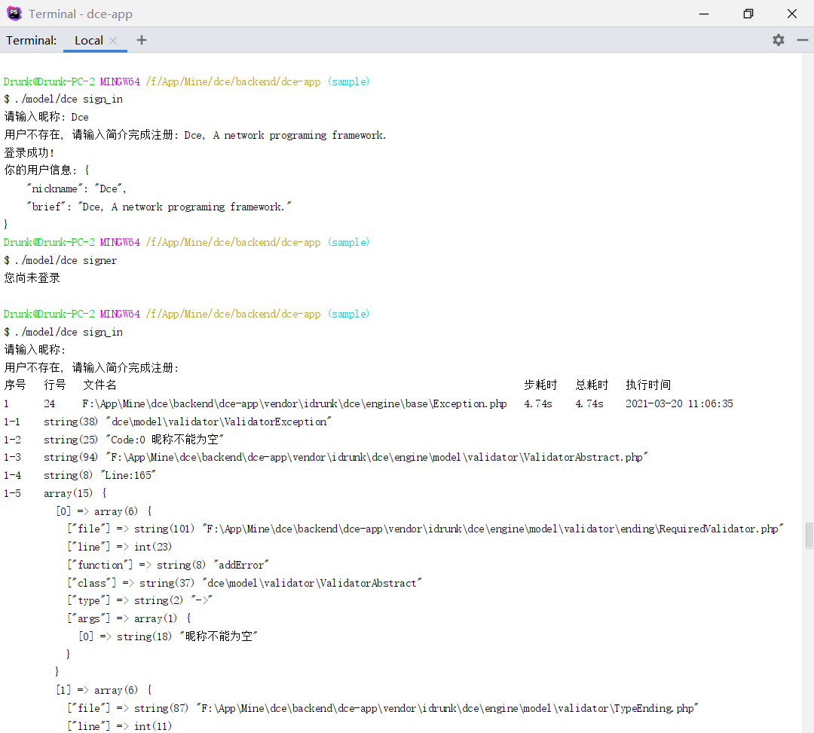

# 模型、校验器、缓存器、事件示例

## 介绍

本示例通过两个命令行接口演示了模型、校验器、缓存器、事件等功能特性的使用

### 演示截图



### 目录结构
```shell
[ROOT]                                        应用根目录（可在入口文件中定义APP_ROOT常量自定义）
├─common                                      公共目录（可在入口文件中定义APP_COMMON常量自定义）
│  ├─config                                   公共配置目录
│  │  ├─config.php                            公共配置文件 (主要配置了引导回调中, 绑定了进入控制器时回调, 用于全局鉴权)
│  ├─model                                    公共模型目录
│  │  ├─Member.php                            Member模型类, 定义了模型属性及IO方法
│  ├─service                                  公共服务目录
│  │  ├─AuthService.php                       鉴权服务类, 鉴定会话权限
│  │  ├─SignService.php                       授权服务类, 注册/登录
├─project                                     项目根目录（可在入口文件中定义APP_PROJECT_ROOT常量自定义）
│  ├─app                                      项目目录
│  │  ├─controller                            项目控制器目录
│  │  │  ├─HomeController.php
├─dce                                         Shell/PHP脚本版Dce工具
├─dce.bat                                     Windows命令行版Dce工具
├─README.md                                   说明文件
```

## 使用

### 注册/登录

本注册/登录接口主用于演示模型/校验器/缓存器的使用，比较简陋，逻辑为：昵称被缓存过则视为已注册，直接登录，否则自动缓存注册，并登录。

```shell
./model/dce sign_in
# 然后按照提示输入昵称简介注册登录
# 你也可以尝试输入空的或者超长等不符合规则的昵称, 测试校验器功能
```

### 鉴权

本鉴权与前述的注册登录无关，只做了事件使用及鉴权方法的演示，直接在事件中写死了业务拦截。

```shell
./model/dce signer
# 将响应 "您尚未登录", 并进入不到接口的控制器方法
```