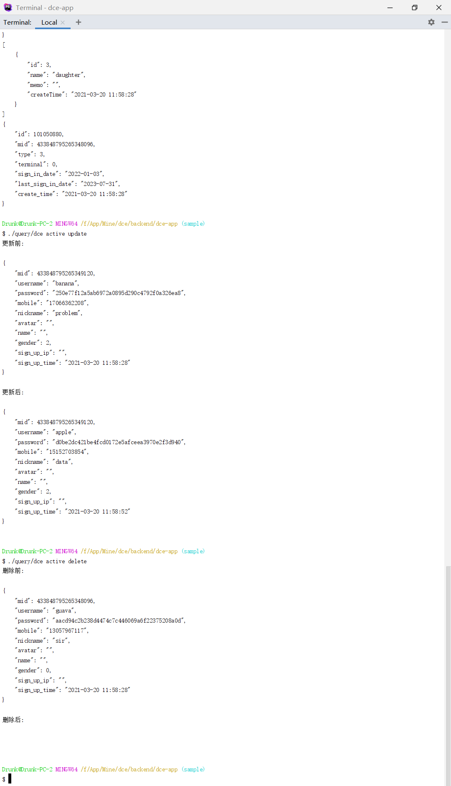

# 查询器、活动记录

## 介绍

本示例演示普通数据库操作，主用于Cgi及非Swoole环境（也可在Swoole环境使用，需配置节点开启协程）。

### 演示截图



### 目录结构
```shell
[ROOT]                                        应用根目录（可在入口文件中定义APP_ROOT常量自定义）
├─.res                                        资源目录
│  ├─dbinit.sql                               建测试数据表用SQL语句
├─common                                      公共目录（可在入口文件中定义APP_COMMON常量自定义）
│  ├─config                                   公共配置目录
│  │  ├─didg                                  ID生成器服务端配置及ID池数据目录（在真实分库应用中需谨慎操作此目录及文件，因为影响ID的生成及对已生成ID的解析，ID生成配置应一次性配置好）
│  │  │  ├─data                               ID生成服务记录数据目录
│  │  │  ├─mid.php                            tag为mid的ID生成配置
│  │  │  ├─msi_id.php                         tag为msi_id的ID生成配置
│  │  ├─config.php                            公共配置文件 (数据库及ID生成器配置)
├─project                                     项目根目录（可在入口文件中定义APP_PROJECT_ROOT常量自定义）
│  ├─app                                      项目目录
│  │  ├─controller                            项目控制器目录
│  │  │  ├─ActiveController.php               活动记录演示控制器
│  │  │  ├─QueryController.php                查询器演示控制器
│  │  ├─model                                 项目模型目录
│  │  │  ├─Member.php                         Member实体类
│  │  │  ├─MemberBadge.php                    MemberBadge实体类
│  │  │  ├─MemberBadgeMap.php
│  │  │  ├─MemberSignIn.php
├─dce                                         Shell/PHP脚本版Dce工具
├─dce.bat                                     Windows命令行版Dce工具
├─README.md                                   说明文件
```

## 使用

测试前需要手动建好数据库，并导入`./.res/dbinit.sql`文件或SQL创建测试数据表，然后将数据库配置修改为你自己的。

为了与分库示例共用数据库结构，数据表建表语句未设置自增主键，需要自己生成ID，所以配置了本地ID生成器。

### 活动记录式数据库操作

（本示例使用了控制器级节点配置特性，可以省略方法节点路径配置）

```shell
# 插入
./query/dce active insert
# 查询
./query/dce active select
# 更新
./query/dce active update
# 删除
./query/dce active delete
```

### 查询器式数据库操作

```shell
# 插入
./query/dce query insert
# 查询
./query/dce query select
# 更新
./query/dce query update
# 删除
./query/dce query delete
```