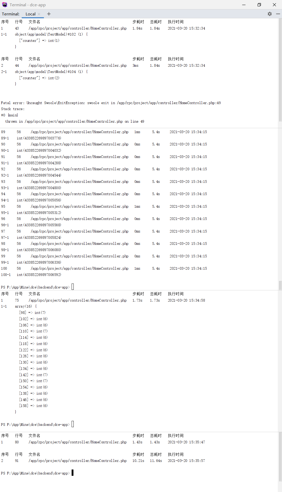

# RPC、ID生成器、负载均衡连接池、并发锁

## 介绍

RPC、ID生成器、负载均衡连接池、并发锁等功能特性使用演示，控制器`\app\controller\HomeController`中有更详细说明。

### 演示截图



### 目录结构
```shell
[ROOT]                                        应用根目录（可在入口文件中定义APP_ROOT常量自定义）
├─common                                      公共目录（可在入口文件中定义APP_COMMON常量自定义）
│  ├─config                                   公共配置目录
│  │  ├─didg                                  ID生成器服务端配置及ID池数据目录（在真实分库应用中需谨慎操作此目录及文件，因为影响ID的生成及对已生成ID的解析，ID生成配置应一次性配置好）
│  │  │  ├─data                               ID生成服务记录数据目录
│  │  │  ├─mid.php                            tag为mid的ID生成配置
│  │  ├─config.php                            公共配置文件 (Redis及ID生成器配置)
├─project                                     项目根目录（可在入口文件中定义APP_PROJECT_ROOT常量自定义）
│  ├─app                                      项目目录
│  │  ├─controller                            项目控制器目录
│  │  │  ├─HomeController.php
│  │  ├─model                                 项目模型目录
│  │  │  ├─TestModel.php                      测试模型
│  │  ├─service                               项目服务目录
│  │  │  ├─TestService.php                    测试用RPC服务器类
├─dce                                         Shell/PHP脚本版Dce工具
├─README.md                                   说明文件
```

## 使用

### 测试RPC

RPC测试案例的主要特点是：RPC服务类名不符合自动加载规则，在RPC服务端手动加载，客户端将该类名注册为远程请求，请求RPC服务端手动加载的服务，响应结果即为RPC方法返回值

需在协程环境使用，但自建进程的服务端不能在协程中使用，所以手动创建了协程容器执行RPC

```shell
ubuntu run podman run --rm --name server -it -v /mnt/f/App/Mine/dce/backend/dce-app/:/app/ idrunk/swoole /app/rpc/dce rpc
```

### 测试ID生成器

需在协程环境使用，所以在节点配置了自动打开协程容器，下同

```shell
ubuntu run podman run --rm --name server -it -v /mnt/f/App/Mine/dce/backend/dce-app/:/app/ idrunk/swoole /app/rpc/dce idg
```

*执行完毕后若未正常退出可以停止进程或容器*

#### 强制停止容器

```shell
ubuntu run podman stop server
```

### 测试Redis负载均衡连接池

示例使用Redis连接池演示，需先配置可正常连接的Redis主机

```shell
ubuntu run podman run --rm --name server -it -v /mnt/f/App/Mine/dce/backend/dce-app/:/app/ idrunk/swoole /app/rpc/dce pool
```

脚本启动了100个协程并发取Redis实例，可以看到实例化了16个Redis对象, 他们被使用了6-7次, 实现了负载均衡（真正的负载均衡是指不同的主机提供相同服务时将请求负载均衡的路由到各主机，Dce的数据库连接池支持主从等复制库配置负载衡，后续若对Redis负载均衡的需求较强烈，也可以很轻松的实现支持）

### 测试并发锁

```shell
ubuntu run podman run --rm --name server -it -v /mnt/f/App/Mine/dce/backend/dce-app/:/app/ idrunk/swoole /app/rpc/dce lock
```

脚本启动了100个协程并发，在里面执行了0.1s协程睡眠，正常情况下100个并发应该在0.1s执行完，但因为对睡眠过程加了锁，使得加锁部分变成了排队执行，最终100协程需要消耗10s执行完