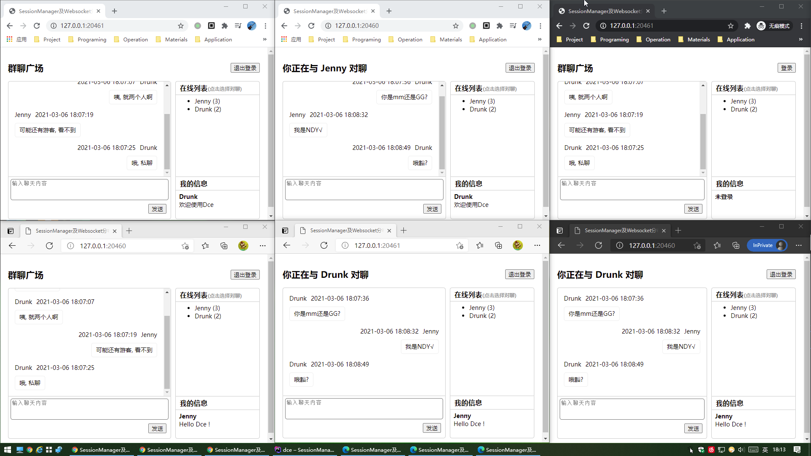

# 分布式Websocket服务及SessionManager应用示例

## 介绍

本示例为较完整的分布式Web服务示例，编写了一套可以部署到多台分布式服务器上的Dce应用代码，为了方便演示，示例将同一个应用目录挂载到两个Podman容器提供服务。

请注意，为了降低部署难度，作者以文件缓存当作数据库、并以文件储存的会话数据，这种方式不能部署于真正的分布式服务器，因为各自的文件无法同步。示例之所以能正常运行，是因为挂载的同一个目录，不同的容器挂载的相同文件。实际的应用中，你应该使用真正的数据库存储消息数据、使用Redis或者自定义的储存器储存会话数据。

*本示例比较简陋，请勿直接商用*

### 演示截图



### 目录结构
```shell
[ROOT]                                        应用根目录（可在入口文件中定义APP_ROOT常量自定义）
├─common                                      公共目录（可在入口文件中定义APP_COMMON常量自定义）
│  ├─config                                   公共配置目录
│  │  ├─config.php                            公共配置（配置了Session自动开启及服务器密匙映射表）
│  │  ├─websocket.php                         Websocket服务配置
├─project                                     项目目录
│  ├─config                                   项目配置目录
│  │  ├─nodes.php                             项目节点配置
│  ├─controller                               项目控制器目录
│  │  ├─ImController.php                      接口控制器
│  │  ├─UiController.php                      界面控制器
│  ├─service                                  项目服务类库目录
│  │  ├─ImEngine.php                          即时通讯服务类
│  ├─view                                     项目视图目录
│  │  ├─index.php                             界面视图文件
├─runtime                                     运行时目录（可在入口文件中定义APP_RUNTIME常量自定义）
│  ├─cache                                    File缓存目录
│  ├─tpl                                      编译模板缓存目录
├─www                                         静态资源目录
├─dce                                         Linux版命令行工具及PHP命令行入口（里面通过APP_PROJECT_ROOT定义了project目录直接作为IM项目目录，而不是项目根目录）
├─README.md                                   说明文件
```

## 使用

### 启动Websocket服务器

1. 创建Pod（作者用的Podman演示，Podman需要将容器放置相同的pod来共享网络等环境，如果你用的docker，则可以使用docker-compose）
```shell
ubuntu run podman pod create -n wssm -p 20460-20462:20460-20462 -p 20463:20463/udp -p 20700-20710:20700-20710
```

2. 启动服务器1
```shell
ubuntu run podman run --rm --name server --pod wssm -it -v /mnt/d/Seafile/Drunk-App/dce/backend/dce-app:/app idrunk/swoole /app/session-manager/dce websocket start
```

3. 启动服务器2
```shell
# 服务器2挂载了与服务器1相同的环境目录, 所以默认端口配置也一样, 这时可以通过命令行指定端口, 避免与服务器1冲突
ubuntu run podman run --rm --name server2 --pod wssm -it -v /mnt/d/Seafile/Drunk-App/dce/backend/dce-app:/app idrunk/swoole /app/session-manager/dce websocket start -port 20460 -api_port 20700 -api_password VjL86kK58Fu3RpRdzuq0YcmN6eXLGPp9
```

### 访问IM

1. 浏览器1打开`http://127.0.0.1:20460`，登录一个账号
2. 浏览器1新开一个标签页，打开`http://127.0.0.1:20461`
3. 浏览器1新开无痕模式，打开`http://127.0.0.1:20460`
   
4. 浏览器2打开`http://127.0.0.1:20461`，登录一个新账号
5. 浏览器2新开一个标签页，打开`http://127.0.0.1:20460`
6. 浏览器2新开无痕模式，打开`http://127.0.0.1:20461`，登录新账号，并修改简介

7. 此时可以发送消息，当你给指定账号发送时，会发到登录该帐号的所有界面（SessionManager按用户发消息的特性）。当你属性步骤4的页面时，简介也改变了（SessionManager按用户写Session的特性）。
8. 开始你的自由发挥吧~

### 关闭服务器
```shell
ubuntu run podman pod stop wssm
```