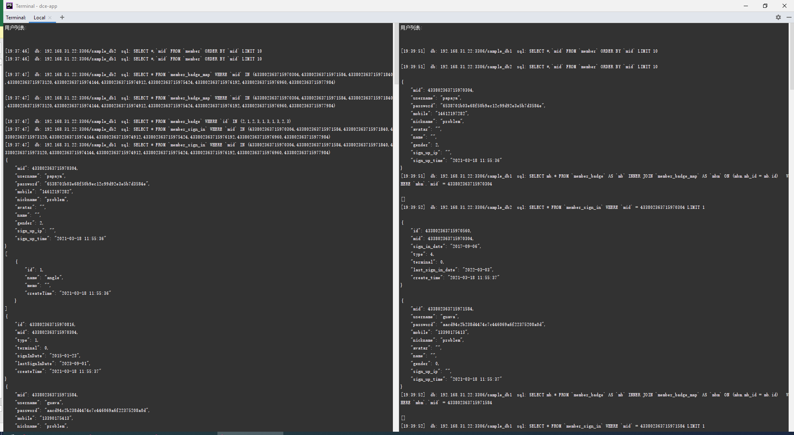

# 分库查询器

## 介绍

分库查询器使用示例，查询方法与非分库查询并无区别，都支持查询器与活动记录式查询。与非分库查询不同的是，需要配置各分库主机端口及分库路由规则。

### 演示截图



### 目录结构
```shell
[ROOT]                                        应用根目录（可在入口文件中定义APP_ROOT常量自定义）
├─.res                                        资源目录
│  ├─dbinit.sql                               建测试数据表用SQL语句
├─common                                      公共目录（可在入口文件中定义APP_COMMON常量自定义）
│  ├─config                                   公共配置目录
│  │  ├─didg                                  ID生成器服务端配置及ID池数据目录（在真实分库应用中需谨慎操作此目录及文件，因为影响ID的生成及对已生成ID的解析，ID生成配置应一次性配置好）
│  │  │  ├─data                               ID生成服务记录数据目录
│  │  │  ├─mid.php                            tag为mid的ID生成配置
│  │  │  ├─msi_id.php                         tag为msi_id的ID生成配置
│  │  ├─config.php                            公共配置文件 (ID生成器与查询日志配置)
│  │  ├─sharding.php                          数据库与分库规则配置
├─project                                     项目根目录（可在入口文件中定义APP_PROJECT_ROOT常量自定义）
│  ├─app                                      项目目录
│  │  ├─controller                            项目控制器目录
│  │  │  ├─ActiveController.php               活动记录演示控制器
│  │  │  ├─QueryController.php                查询器演示控制器
│  │  ├─model                                 项目模型目录
│  │  │  ├─Member.php                         Member实体类
│  │  │  ├─MemberBadge.php                    MemberBadge实体类
│  │  │  ├─MemberBadgeMap.php
│  │  │  ├─MemberLogin.php
├─dce                                         Shell/PHP脚本版Dce工具
├─README.md                                   说明文件
```

## 使用

### 准备工作

1. 新建两个数据库（为方便测试你可以在同主机建两个库，在非同磁盘主机环境环境的分库查询性能更佳），并分别导入`./.res/dbinit.sql`文件或SQL创建测试数据表。

2. 将`sharding.php`里的分库配置修改为你创建的库。

3. 确认分库规则`sharding-> ->mapping`映射的分库别名与分库配置中的别名一致。

### 活动记录式数据库操作

```shell
# 插入
./dce active insert
# 查询
./dce active select
# 更新
./dce active update
# 删除
./dce active delete
```

### 查询器式数据库操作

```shell
# 插入
./dce query insert
# 查询
./dce query select
# 更新
./dce query update
# 删除
./dce query delete
```

如果你仔细比对通过查询器与活动记录方式调用select接口的结果，你会发现两种查询输出的sql记录有一些区别：

1. 发送的查询语句不同。由于活动记录式`select`查询使用了`with`方法，通过该方法能一次性将关系数据查出来，节省Sql请求数。所以你会发现活动记录的`select`在一开始就发送了5条Sql查出全部关系数据，而查询器查询是在遍历时循环查关系数据。当然，with方法并不是万能的，在你不需要用到全部关系数据时调用该方法的话，你用不到的数据也会被全部查出来造成，造成数据库资源浪费，这可能与你想优化查询的初心背道而驰。

2. 部分通过查询器查的关系数据没有选出。这是因为分库的`join`查询目标表必须是相同分库规则的库，Dce对分库的联表查询不能跨库，仅限于应用相同分库规则的数据表的联表查询。示例中关联的`member_badge`表非分库表，这样当查询主表与其不在一个库时，将无法查出。正确的做法应该是先查出分库数据，再遍历这些数据查询非分库的关联数据，或者你也可以使用活动记录的关联数据查询器特性来自动帮你做这些。