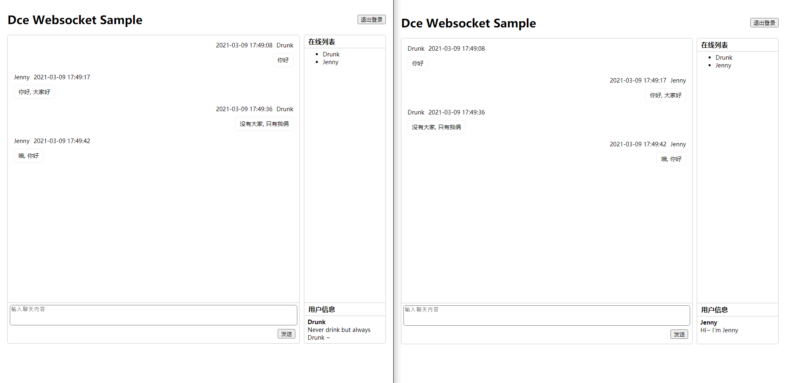

# Websocket即时通信

## 介绍

本示例为简易Websocket即时通讯示例，目的只为以最简单的方式实现即时通讯，让你能快速上手。本即时通讯不保存会话状态，你刷新页面会自动退出，关闭服务器会丢失会话，属于正常现象。如果你需要更完善的即时通讯示例，可以查看[分布式Websocket即时通讯与SessionManager应用](../session-manager/)示例。

本示例有一个注意点，定义了`\sample\service\ImWebsocketServer`类继承`WebsocketServer`，主要目的为了实现服务启动前创建共享内存实例，及连接断开时自动退出登录。一般情况下你无需自定义服务器类，但如果你需要处理某些事件、或者按特定的方式解析消息到Dce请求（如需要解析二进制协议头到对应的Dce节点），则可以通过自定义类继承`WebsocketServer`并相应配置来实现，可以自定义类的`$rawRequestWebsocketClass`静态属性来自己解析处理消息。

### 演示截图



### 目录结构
```shell
[ROOT]                                        应用根目录（可在入口文件中定义APP_ROOT常量自定义）
├─common                                      公共目录（可在入口文件中定义APP_COMMON常量自定义）
│  ├─config                                   公共配置目录
│  │  ├─websocket.php                         Websocket服务配置
├─project                                     项目根目录（可在入口文件中定义APP_PROJECT_ROOT常量自定义）
│  ├─sample                                   项目目录
│  │  ├─config                                项目配置目录
│  │  │  ├─nodes.php                          项目节点配置
│  │  ├─controller                            项目控制器目录
│  │  │  ├─ImServiceController.php            接口控制器
│  │  │  ├─ImUiController.php                 界面控制器
│  │  ├─service                               项目服务类库目录
│  │  │  ├─ImWebsocketServer.php              自定义服务器类
│  │  │  ├─ImWebsocketService.php             即时通讯服务类
│  │  ├─template                              渲染模板录
│  │  │  ├─im                                 即时通讯界面目录
│  │  │  │  ├─ui.php                          界面模板文件
├─runtime                                     运行时目录（可在入口文件中定义APP_RUNTIME常量自定义）
│  ├─cache                                    File缓存目录
│  ├─tpl                                      编译模板缓存目录
├─www                                         静态资源目录
├─dce                                         Linux版命令行工具及PHP命令行入口
├─README.md                                   说明文件
```

## 使用

### 启动Websocket服务器
```shell
# /mnt/d/app/dce/backend/dce-app 路径为你的项目在Wsl Ubuntu中的路径
ubuntu run podman run --rm --name server -it -v /mnt/d/app/dce/backend/dce-app:/app -p 20461-20462:20461-20462 -p 20463:20463/udp idrunk/swoole /app/websocket/dce websocket start
```

### 访问IM
浏览器打开`http://127.0.0.1:20461`（配置了`'enable_http' => true`，所以服务器也能处理HTTP协议），登录一个账号（登录注册二合一），开始聊天

### 关闭服务器
```shell
ubuntu run podman exec server /app/websocket/dce websocket stop
# 如果服务器异常导致无法关闭, 可以停止应用容器或者关闭WSL
ubuntu run podman stop server
```